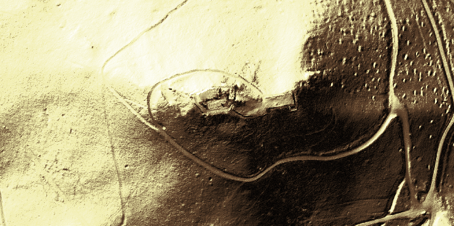
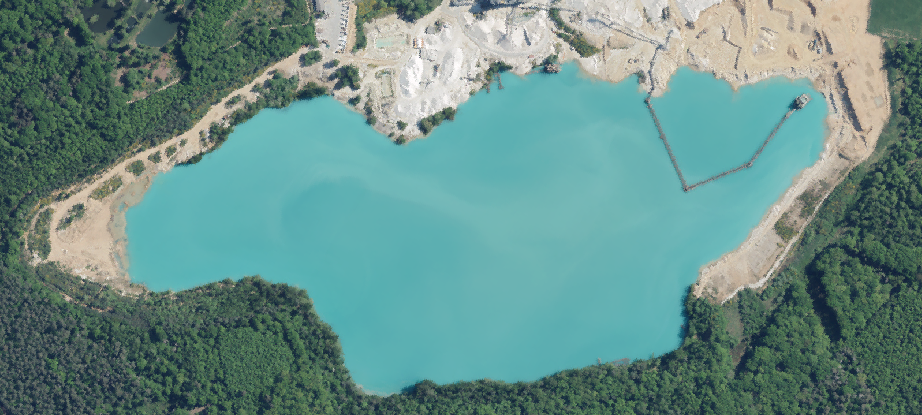
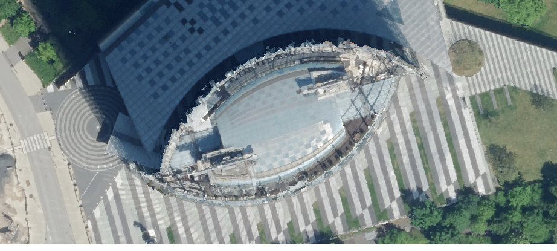

---
# try also 'default' to start simple
theme: default
# random image from a curated Unsplash collection by Anthony
# like them? see https://unsplash.com/collections/94734566/slidev
#background: https://cover.sli.dev
# some information about your slides (markdown enabled)
title: Bikepacking Bonn
class: text-center
drawings:
  persist: false
# slide transition: https://sli.dev/guide/animations.html#slide-transitions
transition: slide-left
# enable Comark Syntax: https://comark.dev/syntax/markdown
comark: true
# duration of the presentation
layout: cover
background: /dgm.png
---

# All eyes on maps

Bikepacking Stammtisch Bonn 3/26 @bitcircus101

---
layout: image-right
image: ./public/strava_heat.png
---

# Agenda

- Hintergrundinfos Digitale Karten
- Kartenvergleich --> Linksammlung
- Digitale Höhenmodelle
- Digitale Orthophotos
- Karten fürs Bikepacking
- OSM Contribution
- Mobile GIS
- Advanced Routing QGIS

  Strava heatmaps

## Brainstorming 🤯 
- `Perfekte` Bikepacking Map
- Unterstüzung der Community (ADFC, weitere?)

---
layout: default
---
# Kartendaten

Crowdsource

- Open Cycle Map, Komoot Standard
https://wiki.openstreetmap.org/wiki/List_of_OSM-based_services

Amtliche Daten

- Topographische Karten, Höhenmodelle (DGM), Orthophotos (DOP), Kataster, 3D Karten

Proprietär

- Hochauflösende Satellitenkarten (Komoot Satellite), Street View, Gewerbliche Infos (z.B. Speisekarte Bistro)

---
layout: iframe
url: ./snippets/map.html
---

---
layout: two-cols-header
---
# Digitales Geländemodell
::left::
- Basiert auf LiDAR Daten
- Sehr hohe Auflösung (10cm-1m)
- Regelmäßige Datenerhebung
- Open Data in vielen Bundesländern und europäischen Nachbarländern
- Hydrologie, Infrastruktur, Bausektor, Archäologie, Tourismus

[read more](https://gdz.bkg.bund.de/index.php/default/digitale-geodaten/digitale-gelandemodelle.html)

## 🎮 Demo

::right::

</img>

</img>

  Bezirksregierung Köln

---
layout: iframe
url: ./snippets/elevation_chart.html
---
# Elevation Profiles

---
layout: iframe
url: ./snippets/elevation_chart_lescun.html
---

---
layout: two-cols-header
---
# Digitale Orthophotos (DOP)
::left::
- Verzerrungsfreie, georeferenzierte Luftbilder
- Sehr hohe Auflösung (5cm - 20cm)
- Regelmäßige Datenerhebung
- Open Data in vielen Bundesländern und europäischen Nachbarländern
- Planungsgrundlage (z. B. im Straßenbau, im Umweltschutz und in der Land- und Forstwirtschaft)
- Beweissicherung im Schadensfall (z. B. bei Naturereignissen)
- [read more](https://www.bezreg-koeln.nrw.de/geobasis-nrw/produkte-und-dienste/luftbild-und-satellitenbildinformationen/aktuelle-luftbild-und-0)

::right::

</img>
</img>

  Bezirksregierung Köln

---
layout: iframe
url: https://www.tim-online.nrw.de/tim-online2/?bg=dop&bbox=332790,5646151,338740,5649341&center=335765,5647746&frame=true&wms=https://www.wms.nrw.de/geobasis/wms-t_nw_hist_dop,nw_hist_dop&time=1970
---

---
layout: center
---
# Demo Mobile GIS

---
layout: center
---
# Demo Advanced Routing 🗺️

---
layout: image-right
image: ./public/osmedit.png
backgroundSize: 80%
---
# Contribute

- Kartenfehler melden
- Fehlende Infos eintragen
- [Guide](https://learnosm.org/en/beginner/)
- https://heigit.org/a-basic-guide-to-osm-data-filtering/

# Follow-Ups
- `Perfekte` Bikepacking Map 😎

---
layout: image-right
image: ./public/analog_map.png
---
# Danke
Slides: https://github.com/hblitza/bikepacking-bonn-maps  
👦 Hannes hannes.blitza@posteo.de
