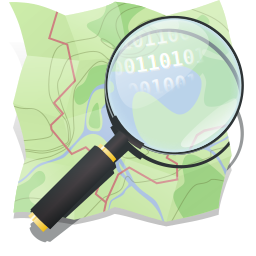
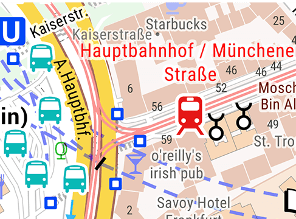
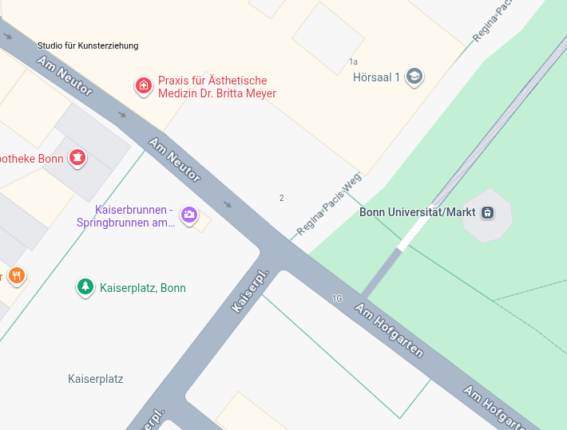
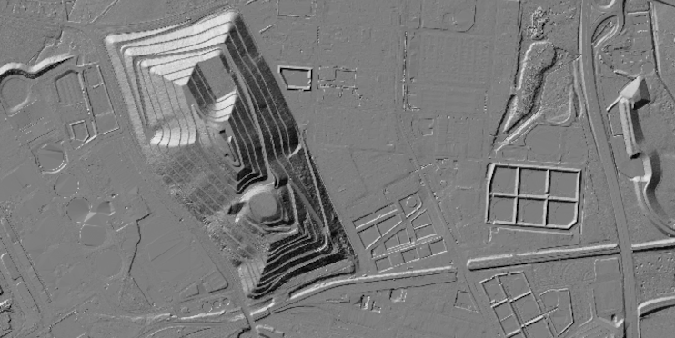

---
# try also 'default' to start simple
theme: default
# random image from a curated Unsplash collection by Anthony
# like them? see https://unsplash.com/collections/94734566/slidev
#background: https://cover.sli.dev
# some information about your slides (markdown enabled)
title: Bikepacking Bonn
class: text-center
drawings:
  persist: false
# slide transition: https://sli.dev/guide/animations.html#slide-transitions
transition: slide-left
# enable Comark Syntax: https://comark.dev/syntax/markdown
comark: true
# duration of the presentation
layout: cover
background: /dgm.png
---

# All eyes on maps

Bikepacking Stammtisch Bonn 3/26 @bitcircus101

---
layout: image-right
image: https://cover.sli.dev
---
# Agenda

- Karten fürs Bikepacking
- Höhenmodelle
- Open Data
- OSM
- Quiz

---
layout: default
---
# Kartendaten

Crowdsource

- Open Cycle Map, Komoot Standard
https://wiki.openstreetmap.org/wiki/List_of_OSM-based_services

Amtliche Daten

- Topographische Karten, Höhenmodelle (DGM), Orthophotos (DOP), Kataster, 3D Karten

Proprietär

- Hochauflösende Satellitenkarten (Komoot Satellite), Street View, Gewerbliche Infos (z.B. Speisekarte Bistro)

---
layout: iframe
url: ./snippets/map.html
---

---
layout: iframe
url: ./snippets/elevation_chart.html
---
# Elevation Profiles

---
layout: iframe
url: ./snippets/elevation_chart_lescun.html
---

---
layout: two-cols-header
---
# Digitales Geländemodell
::left::
- Basiert auf LiDAR Daten
- Sehr hohe Auflösung (20cm-1m)
- Regelmäßige Datenerhebung
- Open Data in vielen Bundesländern und europäischen Nachbarländern
- Hydrologie, Bausektor, Archäologie, ..

::right::

---
layout: iframe
url: https://www.komoot.com/de-de/plan/@50.5412725,6.9729722,15.444z
---
# Komoot

# osm

## https://wiki.openstreetmap.org/wiki/DE:Tag:amenity%3Dbicycle_repair_station

# dop20 beispiele
